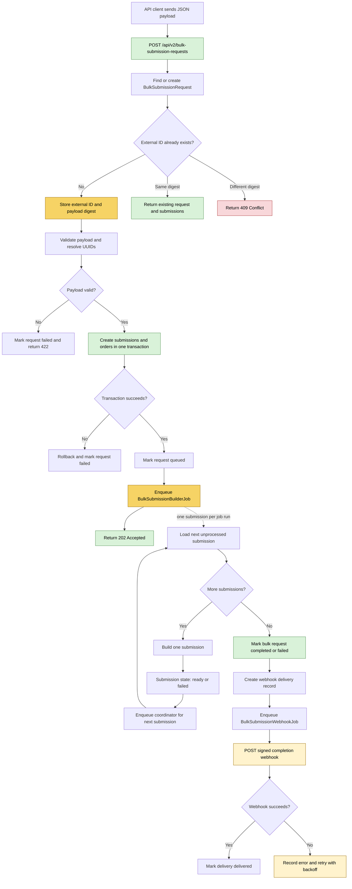

# Proposed bulk submission API flow

This document proposes an idempotent bulk-submission API endpoint. The bulk request is persisted as the idempotency and coordination record. A coordinator job builds its submissions sequentially, then creates a durable webhook delivery once the whole operation reaches a terminal state.

