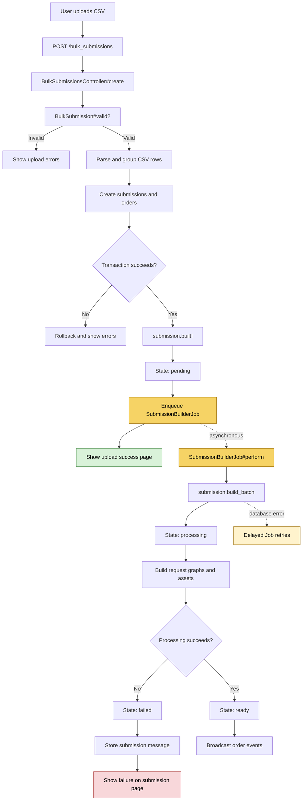

# Bulk submission upload flow

This document summarises the code path for bulk submission CSV uploads in Sequencescape.

## Overview

A CSV upload is validated and converted into one or more `Submission` records during the upload request. Each submission is then queued for asynchronous processing. The upload response can report synchronous validation errors, but failures in the delayed job are reported on the individual submission page after processing.

## Synchronous upload path

1. The upload form submits to `POST /bulk_submissions`, handled by `BulkSubmissionsController#create`.
2. `BulkSubmission#valid?` checks that the file is present, non-empty, a CSV, correctly encoded, and has a compatible header row.
3. The CSV is parsed and rows are grouped by submission name.
4. Each group is converted into orders and a `Submission` record. User, project, template, and order validations are applied.
5. The submission records are created in a database transaction. If an error is added while processing any group, the transaction is rolled back.
6. Successful submissions call `submission.built!`, changing the state from `building` to `pending` and enqueueing `SubmissionBuilderJob`.
7. The controller renders the success page with the created submission links and any upload-time warnings.

Relevant code:

- `app/controllers/bulk_submissions_controller.rb`
- `app/models/bulk_submission.rb`
- `app/models/submission/state_machine.rb`
- `app/models/submission/delayed_job_behaviour.rb`

## Asynchronous builder path

1. `SubmissionBuilderJob#perform` reloads the submission by ID and calls `build_batch`.
2. `build_batch` runs `finalize_build!` in a database transaction.
3. `process!` changes the submission from `pending` to `processing`.
4. Entering `processing` calls `Submission#process_submission!`.
5. Each order builds its request graph, creating the required requests, assets, and multiplexing relationships. Multiplexing assets can be passed between orders.
6. Any required pre-capture pools are built, and processing fails if no requests were created.
7. If processing succeeds, `ready!` changes the submission to `ready` and broadcasts order events.

Relevant code:

- `app/jobs/submission_builder_job.rb`
- `app/models/submission/delayed_job_behaviour.rb`
- `app/models/submission/state_machine.rb`
- `app/models/submission.rb`
- `app/models/submission/linear_request_graph.rb`
- `app/models/submission/flexible_request_graph.rb`

## Failure behaviour

Validation and parsing failures happen during the upload request and are shown immediately on the upload form.

Failures raised while building a submission are handled by `build_batch` as follows:

- `ActiveRecord::RecordInvalid` and `Submission::ProjectValidation::Error` mark the submission as `failed` and store the error in `submission.message`.
- Other unexpected errors are logged, mark the submission as `failed`, and store a truncated error message.
- `ActiveRecord::StatementInvalid` is re-raised so Delayed Job can retry, which is intended for transient database problems.

The bulk upload success page does not poll for delayed-job results. The stored failure is shown later on the individual submission page through `submission_status_message`.
