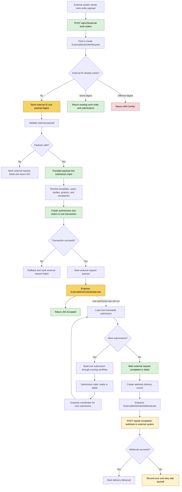

# Proposed external work-order API flow

This document proposes an idempotent API endpoint for external work orders. An external work order is a request from another system and is not the same as Sequencescape's existing `WorkOrder` model, which groups requests after they have been created. The endpoint therefore persists the external request, translates its payload into one or more ordinary Sequencescape `Submission` records, and then uses the existing submission-building workflow.

## Translation boundary

The external work-order adapter should convert the external payload into the canonical input needed to create Sequencescape submissions and orders. It should resolve external identifiers and map external concepts to Sequencescape concepts, including:

- external work-order type to a submission template;
- external user or account to a Sequencescape user;
- external study and project references to Sequencescape records;
- external source containers to receptacles;
- external options to order request options;
- one external work order to one or more submissions when the payload requires it.

The mapper should not build request graphs directly. Once the submissions are created and queued, the existing submission state machine and builder workflow remain responsible for creating requests and target receptacles.

## Existing `WorkOrder` distinction

Sequencescape's existing `WorkOrder` model groups already-created requests by work-order type. It is produced downstream from submission processing and should not be used as the inbound idempotency record for this endpoint. A separate parent record, such as `ExternalWorkOrderRequest`, can store the external ID, payload digest, callback details, mapping status, and references to the generated submissions.
