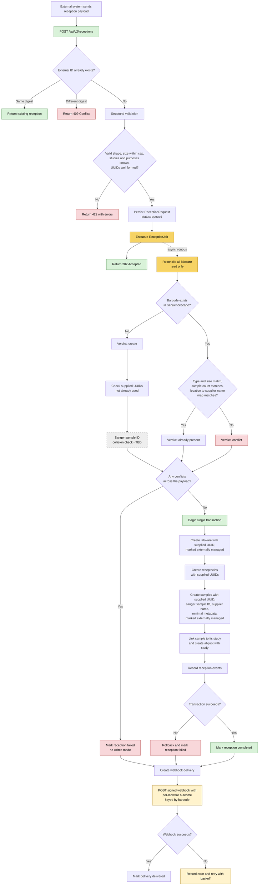

# Proposed sample and labware reception API flow

This document proposes an asynchronous, idempotent API endpoint for receiving samples and labware from an external system. It is similar in purpose to a sample manifest upload, but does not use the sample manifest tables.

For each labware in the payload, Sequencescape either creates new labware, receptacles and samples, or recognises the labware as already present. The external system supplies the UUIDs for labware, receptacles and samples, as well as the Sanger sample ID and supplier name for each sample. Study is supplied per sample, so a single plate can contain samples from several studies.

## Reconciliation

Every labware in the payload is checked before any records are written:

- **Barcode not found:** the labware, receptacles and samples are created as new.
- **Barcode found and contents match:** the labware is treated as already present and is not written. Contents match when the labware type and size are the same, the sample count is the same, and each location holds the same supplier name. Supplier names do not need to be unique within a labware, because they are compared by location. Well positions should be normalised before comparison, for example `A1` and `A01`.
- **Barcode found and contents differ:** the labware is a conflict.

Any conflict rejects the whole reception. Because conflicts are found before writing, they never cause a rollback.

Already-present labware and samples are not linked to the external system's records by UUID. The payload UUIDs for them are ignored, and the two systems' records correspond only by barcode for labware and supplier name for samples. See [ADR 074: Work orders for Labware and Samples previously known to Sequencescape](https://ssg-confluence.internal.sanger.ac.uk/spaces/SLIM/pages/354943562/ADR+074+%C2%A0Work+orders+for+Labware+and+Samples+previously+known+to+Sequencescape).

## Writes

All new records are created in a single transaction, so a reception is all-or-nothing. A payload size cap limits how large that transaction can become. Clients split large receptions into several calls.

New labware, receptacles and samples use the UUIDs supplied by the external system rather than generated ones. `Heron::Factories::Sample#replace_uuid` is an existing example of this. Supplied UUIDs must be lowercase and in canonical form, and must not already exist. The receptacle UUIDs matter in particular, because the well UUID is used as the `stock_resource_uuid` in the multi-LIMS warehouse.

New labware and samples are marked `externally_managed` when their UUIDs are stored, so Sequencescape can identify records that came from an external system. Already-present records are never marked, because their UUIDs are not stored. Child labware created later in Sequencescape is not marked either.

The flag's main purpose is to stop externally managed samples being broadcast to the multi-LIMS warehouse, because the external system writes those sample rows itself. `Sample` switches from `broadcast_with_warren` to `broadcast_with_warren_except_externally_managed`, as `Study` already uses. This applies to every save, so later edits to these samples in Sequencescape are not broadcast either. Unlike on `Study`, the flag does not lock samples or labware against edits.

Aliquots are not flagged and still broadcast, but they need no handling. Their messages are published as `saved.aliquot.<id>`, and the unified warehouse consumer is not bound to that routing key, so they are not written to the warehouse.

Another process could create a barcode between reconciliation and the write transaction. A unique constraint on barcodes would make the write fail and roll back. Otherwise, the write transaction should check the barcodes again.

## Out of scope

- Sample manifest and sample manifest asset tables.
- Generating Sanger sample IDs.
- `register_stock!`. The external system writes stock resource and sample rows to the multi-LIMS warehouse directly. For already-present labware, the warehouse will hold two sets of rows for the same records, which has been accepted.
- Create asset requests.
- Accessioning.
- Retention instructions and supplier records.

## Webhook

A signed webhook is sent whether the reception completes or fails. It reports the outcome for each labware, keyed by barcode: created, already present or conflict. It does not return Sequencescape UUIDs. Created records already use the payload UUIDs, and already-present records are deliberately not linked by UUID, as described in ADR 074.

## Open questions

- **Sanger sample ID collisions:** what to do when an incoming Sanger sample ID already exists in Sequencescape on different labware. The `samples.sanger_sample_id` column is indexed but not unique.
